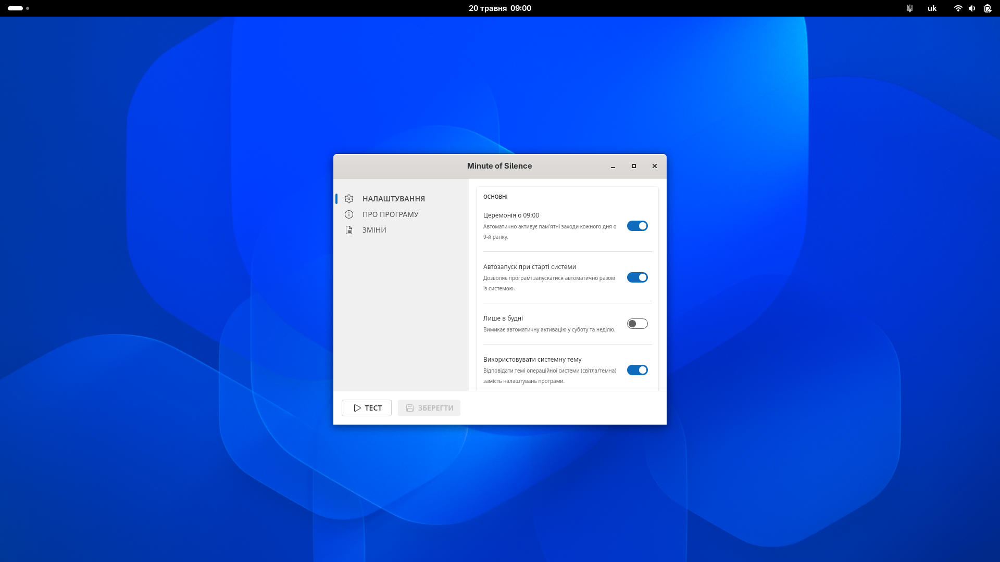
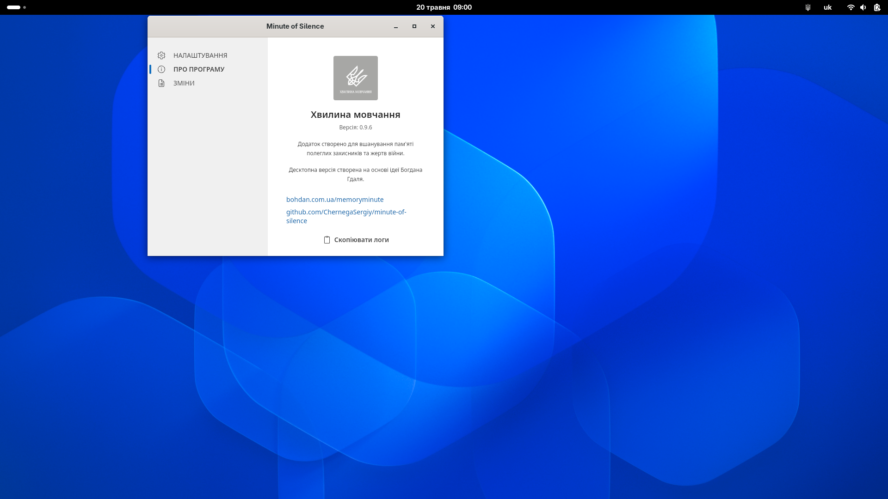
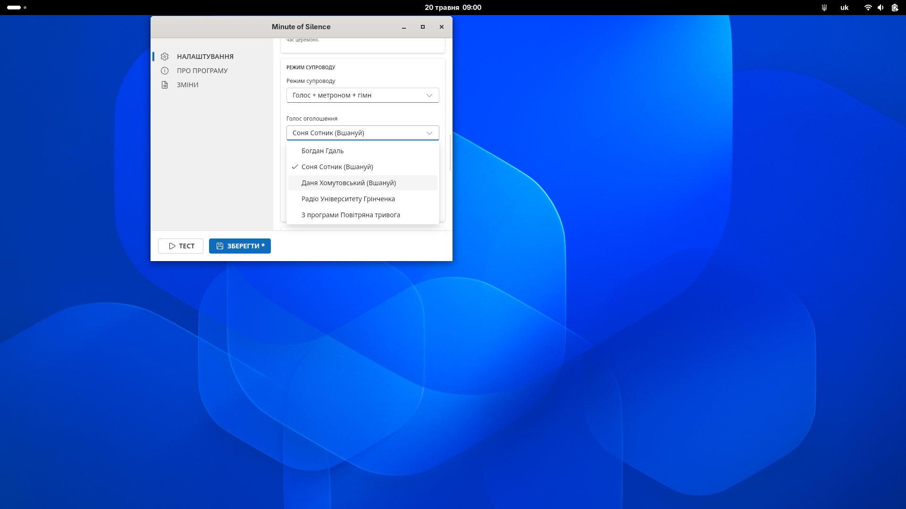
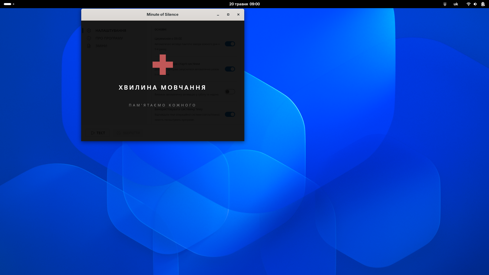

# Minute of Silence

[](https://snapcraft.io/minute-of-silence)
[](https://github.com/ChernegaSergiy/minute-of-silence/actions)
[](LICENSE)
[](https://github.com/ChernegaSergiy/minute-of-silence/releases)

Minute of Silence is a lightweight desktop application built with [Tauri 2](https://tauri.app) (Rust + TypeScript) that runs silently in the system tray and accurately triggers the daily ceremony at 09:00 using NTP time correction. Upon activation, it automatically pauses background media, plays a selected audio preset, and seamlessly restores playback afterward, offering flexible control through persistent settings and a convenient one-shot skip option.

## Screenshots

| Main Settings | About Tab |
| :---: | :---: |
|  |  |
| **Audio Settings** | **Active Ceremony Overlay** |
|  |  |

## Features

- **Automatic Daily Activation**: Activates at 09:00 with NTP time correction.
- **Eight Audio Presets**: Voice announcement combined with silence, bell, metronome, and/or national anthem.
- **Media Management**: Pauses Spotify, browser video, VLC, and other players before the ceremony; resumes them after (supports MPRIS on Linux).
- **Visual Status**: A status indicator appears in the main window during the ceremony (full-screen overlay planned).
- **Skip Next**: Suppresses a single upcoming activation via the tray menu or the main window.
- **Post-Sleep Handling**: If the system wakes from sleep after 09:00, a configurable grace window decides whether to activate late or skip.
- **Persistent Settings**: Stored as JSON in the platform config directory; no registry writes.
- **Autostart on Login**: Can be registered for autostart via the settings menu.
- **Structured Logging**: Log files written to the platform log directory.

## Audio Presets

| # | Preset | Description |
|---|--------|-------------|
| 1 | Voice + Metronome | Announcement with a metronome for the silence duration |
| 2 | Metronome | Metronome only (no voice) |
| 3 | Voice + Silence + Bell | Announcement, 60 s of silence, closing bell |
| 4 | Voice + Silence | Announcement followed by 60 s of silence |
| 5 | Voice + Metronome + Anthem | Announcement, metronome, then anthem |
| 6 | Metronome + Anthem | Metronome followed by the national anthem |
| 7 | Bell + Silence + Bell | Bell, 60 s of silence, closing bell |
| 8 | Bell + Metronome + Bell | Bell, metronome, closing bell |

## Installation

### Windows

[](https://apps.microsoft.com/detail/9N6P3X0KDD5W)

Alternatively, you can download the `.msi` or `.exe` installer from the [Releases](https://github.com/ChernegaSergiy/minute-of-silence/releases) page. The application will start in the system tray, and autostart can be enabled in the settings.

### Linux (Ubuntu / Debian)

[](https://snapcraft.io/minute-of-silence)

```bash
# Debian package
sudo dpkg -i minute-of-silence_0.5.1_amd64.deb

# AppImage
chmod +x minute-of-silence_0.5.1_amd64.AppImage
./minute-of-silence_0.5.1_amd64.AppImage
```

## Building from Source

### Prerequisites

| Tool | Minimum version |
|------|----------------|
| Rust | 1.75 |
| Node.js | 20 LTS |
| Tauri CLI | 2.x |

Install the Tauri CLI:

```bash
npm install -g @tauri-apps/cli
```

**Linux only** — install required system libraries:

```bash
sudo apt-get install -y \
  libwebkit2gtk-4.1-dev libappindicator3-dev \
  librsvg2-dev patchelf libasound2-dev
```

### Development

```bash
git clone https://github.com/ChernegaSergiy/minute-of-silence.git
cd minute-of-silence
npm install
npm run tauri dev
```

### Release build

```bash
npm run tauri build
```

Artifacts are written to `src-tauri/target/release/bundle/`.

## Project Structure

```
minute-of-silence/
+-- src/                         # TypeScript frontend (Vite)
|   +-- api.ts                   # Typed wrappers around Tauri invoke()
|   +-- app.ts                   # Root UI controller
|   \-- types.ts                 # Shared types, mirrors Rust structs
+-- src-tauri/
|   +-- src/
|   |   +-- core/
|   |   |   +-- audio.rs         # Backend audio engine (rodio)
|   |   |   +-- ntp.rs           # NTP client logic
|   |   |   +-- ntp_service.rs   # NTP sync service and offset caching
|   |   |   +-- platform.rs      # Platform abstraction trait
|   |   |   +-- scheduler.rs     # Daily trigger loop with NTP correction
|   |   |   \-- settings.rs      # Persistent settings and audio presets
|   |   +-- platform/            # Native platform implementations
|   |   +-- commands.rs          # Tauri IPC command handlers
|   |   +-- tray.rs              # System tray icon and context menu
|   |   +-- state.rs             # Shared application state (Arc<Mutex>)
|   |   +-- error.rs             # Unified error type
|   |   +-- main.rs              # Rust entry point
|   |   +-- lib.rs               # Library root and Tauri setup
|   |   +-- platform_windows.rs  # Win32 API — media control, power events
|   |   \-- platform_linux.rs    # MPRIS / xdotool — media control
|   +-- audio/                   # Source audio files (.ogg)
|   \-- tests/                   # Rust integration tests
+-- docs/
|   \-- architecture.md          # System design and data flow
+-- public/                      # Static assets (logo, etc.)
+-- .github/
|   +-- workflows/ci.yml         # CI/CD pipeline (lint, test, build)
|   +-- ISSUE_TEMPLATE/          # Bug report and feature request forms
|   \-- dependabot.yml           # Automated dependency updates
+-- CHANGELOG.md
+-- CONTRIBUTING.md
\-- index.html                   # App shell with embedded CSS
```

## Contributing

Contributions are welcome and appreciated! Here's how you can contribute:

1. Fork the project
2. Create your feature branch (`git checkout -b feature/AmazingFeature`)
3. Commit your changes (`git commit -m 'Add some AmazingFeature'`)
4. Push to the branch (`git push origin feature/AmazingFeature`)
5. Open a Pull Request

Please make sure to update tests as appropriate and adhere to the existing coding style.

## License

This project is licensed under the CSSM Unlimited License v2.0 (CSSM-ULv2). See the [LICENSE](LICENSE) file for details.
