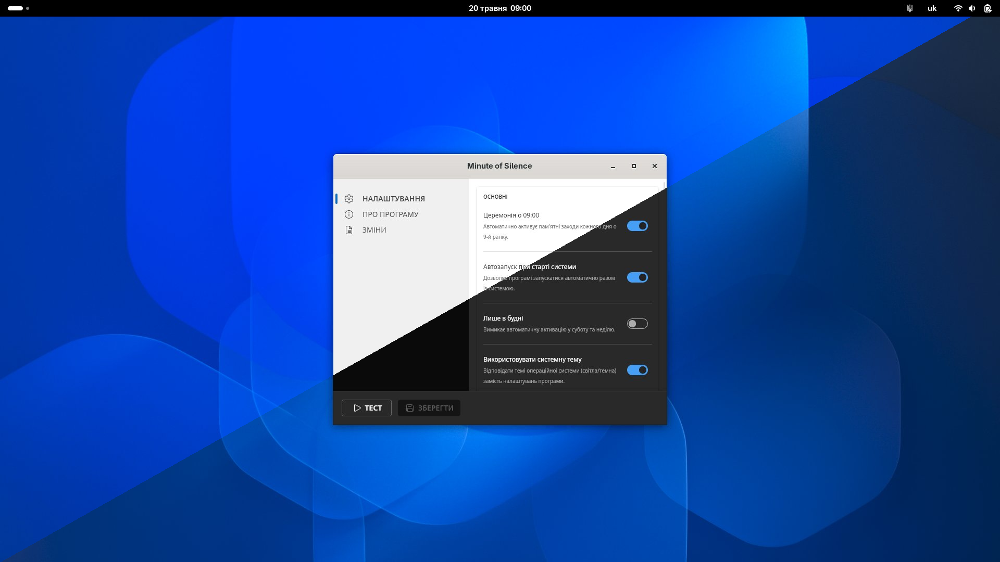
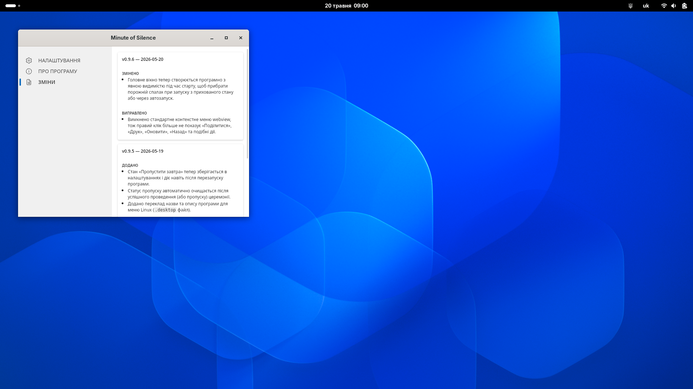

# Minute of Silence

[](https://snapcraft.io/minute-of-silence)
[](https://github.com/ChernegaSergiy/minute-of-silence/actions)
[](LICENSE)

Minute of Silence is a lightweight desktop application built with [Tauri 2](https://tauri.app) (Rust + TypeScript) that runs silently in the system tray and accurately triggers the daily ceremony at 09:00 using NTP time correction. Upon activation, it automatically pauses background media, plays a selected audio preset, and seamlessly restores playback afterward, offering flexible control through persistent settings and a convenient one-shot skip option.

## Screenshots

| Main Settings | Audio Settings |
| :---: | :---: |
|  |  |
| **Theme Collage** | **About Tab** |
|  |  |
| **Changelog Tab** | **Active Ceremony Overlay** |
|  |  |

## Features

- **Automatic Daily Activation**: Activates at 09:00 with NTP time correction.
- **Ten Audio Presets**: Voice announcement combined with silence, bell, metronome, national anthem, and/or ending, plus a silent "Silence" preset.
- **Voice Selection**: Four announcer voices available (original, Vshanui organization voices, Air Alert app).
- **Media Management**: Pauses Spotify, browser video, VLC, and other players before the ceremony (supports MPRIS on Linux).
- **Visual Status**: A status indicator appears in the main window during the ceremony (full-screen overlay planned).
- **Skip Next**: Suppresses a single upcoming activation via the tray menu or the main window.
- **Post-Sleep Handling**: If the system wakes from sleep after 09:00, a configurable grace window decides whether to activate late or skip.
- **Persistent Settings**: Stored as JSON in the platform config directory; no registry writes.
- **Autostart on Login**: Can be registered for autostart via the settings menu.
- **Structured Logging**: Log files written to the platform log directory.

## Audio Presets

| # | Preset | Description |
| --- | --- | --- |
| 1 | Voice + Metronome | Announcement with a metronome for the silence duration |
| 2 | Metronome | Metronome only (no voice) |
| 3 | Voice + Silence + Bell | Announcement, 60 s of silence, closing bell |
| 4 | Voice + Silence | Announcement followed by 60 s of silence |
| 5 | Voice + Metronome + Anthem | Announcement, metronome, then anthem |
| 6 | Voice + Metronome + Ending | Announcement, metronome, then ending ("Slava Ukrajini") |
| 7 | Metronome + Anthem | Metronome followed by the national anthem |
| 8 | Bell + Silence + Bell | Bell, 60 s of silence, closing bell |
| 9 | Bell + Metronome + Bell | Bell, metronome, closing bell |
| 10 | Silence | Visual overlay and pause other players only, no sound |

## Voice Selection

| # | Voice | Description |
| --- | --- | --- |
| 1 | Bohdan Hdal | Original voice with "Slava Ukrajini" ending |
| 2 | Sonia Sotnyk | Voice from Vshanui with "Slava Ukrajini" ending |
| 3 | Dania Khomutovskyi | Voice from Vshanui with "Slava Ukrajini" ending |
| 4 | Radio BG | Audio recording from Grinchenko University Radio (announcement and ending available) |
| 5 | Air Alert | Voice from the Air Alert app (announcement only, no ending) |

## Installation

### Windows

[](https://apps.microsoft.com/detail/9N6P3X0KDD5W)

Alternatively, you can download the `.msi` or `.exe` installer from the [Releases](https://github.com/ChernegaSergiy/minute-of-silence/releases) page. The application will start in the system tray, and autostart can be enabled in the settings.

### Linux (Ubuntu / Debian)

[](https://snapcraft.io/minute-of-silence)

```bash
# Debian package
sudo dpkg -i minute-of-silence_0.9.7_amd64.deb

# AppImage
chmod +x minute-of-silence_0.9.7_amd64.AppImage
./minute-of-silence_0.9.7_amd64.AppImage
```

## Building from Source

### Prerequisites

| Tool | Minimum version |
| --- | --- |
| Rust | 1.85 |
| Node.js | 20 LTS |
| Tauri CLI | 2.x |

Install the Tauri CLI:

```bash
npm install -g @tauri-apps/cli
```

**Linux only** — install required system libraries:

```bash
sudo apt-get install -y \
  libwebkit2gtk-4.1-dev libappindicator3-dev \
  librsvg2-dev patchelf libasound2-dev
```

### Development

```bash
git clone https://github.com/ChernegaSergiy/minute-of-silence.git
cd minute-of-silence
npm install
npm run tauri dev
```

### Release build

```bash
npm run tauri build
```

#### Flatpak
To build and install the Flatpak package locally:

```bash
# Install flatpak-builder if needed (example for Fedora/Ubuntu)
sudo dnf install flatpak-builder 
# or: sudo apt install flatpak-builder

# Build and install locally
flatpak-builder --user --install --force-clean --ccache build-dir flatpak/ua.pp.khvylyna.MinuteOfSilence.yml
```

#### Windows (MSIX)
The application is distributed as an **MSIX package** to support native Windows features. To build and sign the package manually:

1. **Assemble the Bundle**:
   Collect the binary, manifest, and resources (audio and localized PRI files) into a single folder:
   ```powershell
   # Create directory structure
   New-Item -ItemType Directory -Path dist\msix\audio -Force

   # Copy manifest and compiled binary
   copy appxmanifest.xml dist\msix\AppxManifest.xml
   copy src-tauri\target\release\MinuteOfSilence.exe dist\msix\

   # Copy audio and localized resources
   Copy-Item src-tauri\audio\*.ogg dist\msix\audio\
   Copy-Item -Path src-tauri\Strings -Destination dist\msix\Strings -Recurse -Force
   Copy-Item dist\msix\Strings\resources.pri dist\msix\resources.pri
   ```

2. **Package and Sign**:
   Windows requires signed packages. Use the [WinApp SDK CLI](https://github.com/microsoft/WinAppCli) tool to handle certificate generation and bundling in one step:
   ```powershell
   winapp package dist\msix --manifest AppxManifest.xml --output dist\minute-of-silence.msix --generate-cert --install-cert
   ```

> [!NOTE]
> The `--generate-cert` and `--install-cert` flags are only required for the first build on a new machine.

Artifacts are written to `src-tauri/target/release/bundle/`.

## Project Structure

```
minute-of-silence/
+-- src/                              # TypeScript frontend (Vite)
|   +-- api.ts                        # Typed wrappers around Tauri invoke()
|   +-- app.ts                        # Root UI controller
|   \-- types.ts                      # Shared types, mirrors Rust structs
+-- src-tauri/
|   +-- src/
|   |   +-- app/                      # Tauri entry points
|   |   |   +-- mod.rs
|   |   |   +-- commands.rs           # Tauri IPC command handlers
|   |   |   \-- tray.rs               # System tray icon and context menu
|   |   +-- core/                     # Business logic
|   |   |   +-- mod.rs
|   |   |   +-- audio.rs              # Backend audio engine (rodio)
|   |   |   +-- ceremony.rs           # Ceremony orchestration and lifecycle
|   |   |   +-- ntp.rs                # NTP client logic
|   |   |   +-- ntp_service.rs        # NTP sync service and offset caching
|   |   |   +-- scheduler.rs          # Daily trigger loop with NTP correction
|   |   |   \-- settings.rs           # Persistent settings and audio presets
|   |   +-- platform/                 # Platform abstraction and implementations
|   |   |   +-- mod.rs                # Platform trait and get_platform()
|   |   |   +-- windows/
|   |   |   |   +-- mod.rs
|   |   |   |   +-- media.rs          # Win32 API — media control
|   |   |   |   +-- notifications.rs  # MSIX toast notifications via WinRT
|   |   |   |   +-- power.rs          # Win32 power events (wake from sleep)
|   |   |   |   \-- volume.rs         # Win32 API — system volume control
|   |   |   \-- linux/
|   |   |       +-- mod.rs
|   |   |       +-- autostart.rs      # Snap autostart .desktop management
|   |   |       +-- media.rs          # MPRIS D-Bus media control
|   |   |       \-- volume.rs         # ALSA system volume control
|   |   +-- error.rs                  # Unified error type
|   |   +-- state.rs                  # Shared application state (Arc<Mutex>)
|   |   +-- main.rs                   # Rust entry point
|   |   \-- lib.rs                    # Library root and Tauri setup
|   +-- audio/                        # Source audio files (.ogg)
|   \-- tests/                        # Rust integration tests
+-- docs/
|   +-- architecture.md               # System design and data flow
|   \-- images/                       # Documentation images (screenshots)
+-- public/                           # Static assets (logo, etc.)
+-- .github/
|   +-- workflows/ci.yml              # CI/CD pipeline (lint, test, build)
|   +-- ISSUE_TEMPLATE/               # Bug report and feature request forms
|   \-- dependabot.yml                # Automated dependency updates
+-- CHANGELOG.md
+-- CONTRIBUTING.md
\-- index.html                        # App shell with embedded CSS
```

## Contributing

Contributions are welcome and appreciated! Here's how you can contribute:

1. Fork the project
2. Create your feature branch (`git checkout -b feature/AmazingFeature`)
3. Commit your changes (`git commit -m 'Add some AmazingFeature'`)
4. Push to the branch (`git push origin feature/AmazingFeature`)
5. Open a Pull Request

Please make sure to update tests as appropriate and adhere to the existing coding style.

## License

This project is licensed under the CSSM Unlimited License v2.0 (CSSM-ULv2). See the [LICENSE](LICENSE) file for details.

## Acknowledgments

- Inspired by Bohdan Hdal's ["MemoryMinute" app](https://bohdan.com.ua/memoryminute)
