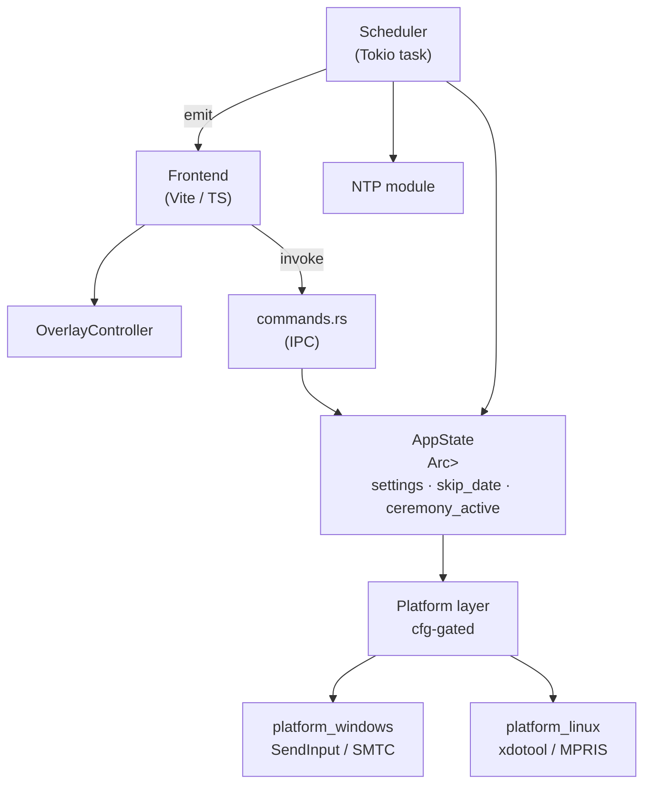

# Architecture

## Overview



## Key design decisions

### Why Tauri instead of Electron?
Tauri's Rust backend gives us direct access to Win32 and Linux system APIs
without an extra IPC layer, and the resulting binary is ~5 MB vs ~150 MB for
an equivalent Electron app.

### Shared state via `Arc<Mutex<Inner>>`
The scheduler runs as a long-lived `tokio` task on the async runtime.  Tauri
commands run on the Tauri thread pool.  A single `Arc<Mutex<Inner>>` wrapped
in the `AppState` newtype is the simplest correct approach for this scale.

### Why `SendInput(VK_MEDIA_PLAY_PAUSE)` instead of per-process muting?
`VK_MEDIA_PLAY_PAUSE` works for every media app without requiring per-app
integration.  `IAudioSessionControl` (Core Audio) is available as a future
enhancement for cases where targeted muting is needed without pausing.

### Settings persistence
Settings are serialised as pretty-printed JSON to the platform config
directory:
- **Windows:** `%APPDATA%\minute-of-silence\settings.json`
- **Linux:** `~/.config/minute-of-silence/settings.json`

### NTP Synchronization Strategy
The app supports both system clock and NTP-corrected time. 
A manual synchronization feature is provided via a dedicated `sync_ntp_now` 
IPC command that updates the shared state and triggers immediate correction.

### Native Look & Feel
To ensure the application feels like a native desktop tool:
- **Text Selection:** Disabled globally via CSS.
- **Context Menu:** Standard browser context menu is blocked.
- **Typography:** Uses a high-quality monospace font stack (Ubuntu Mono, JetBrains Mono, etc.).

## Data flow: ceremony trigger

```
Scheduler loop (every 1 s)
  ├─ sync_ntp() if needed          ← hourly or on sleep resume
  └─ get_synchronized_now()        ← NTP-corrected or system clock
       └─ Should trigger today?
            ├─ Compensation window: [09:00 - compensation, 09:00)  ← voice/bell early start
            └─ Grace window: [09:00, 09:00 + grace_minutes)        ← late start / wake up
                 └─ trigger_ceremony() (CeremonyManager)
                      ├─ Set ceremony_active = true & last_activation = now
                      ├─ Setup flag animation webview window (if enabled & preset has anthem)
                      ├─ emit("ceremony-start", { duration_ms })   → Frontend shows overlay
                      ├─ platform.pause_media()                    → Pause other players (if enabled)
                      ├─ Auto-unmute & set system volume priority
                      ├─ audio_engine.play_preset(...)             → Runs on a dedicated thread
                      └─ finish_ceremony()                         ← Called when audio ends
                           ├─ Restore system volume & mute states
                           ├─ platform.resume_media(...)           → Resume players (if enabled)
                           ├─ Clear settings.skip_date from store
                           └─ emit("ceremony-end")                 → Frontend hides overlay
```
